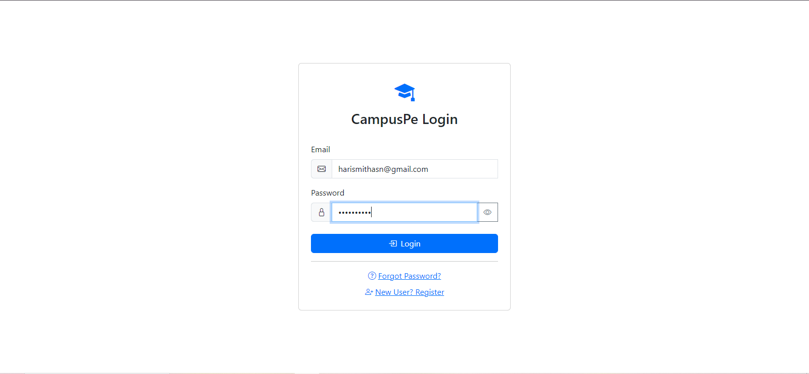
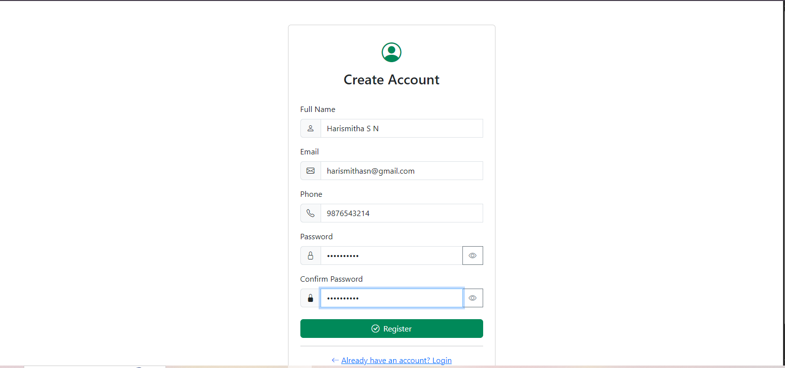
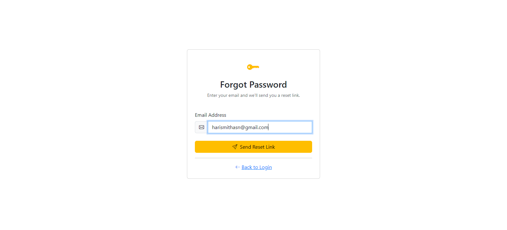
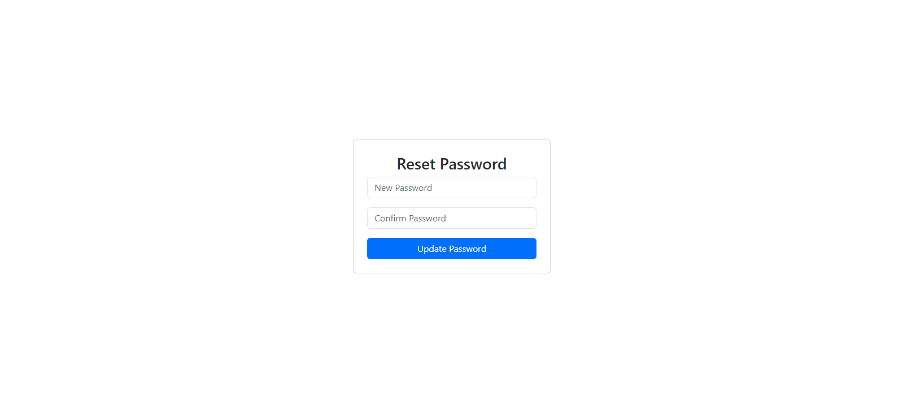
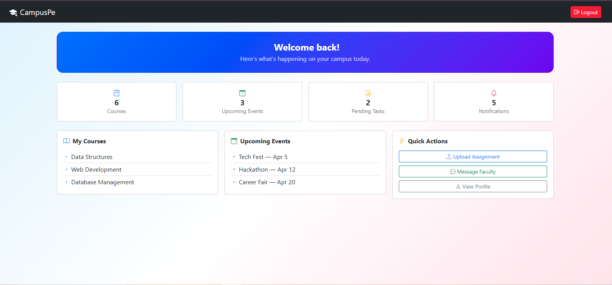

# Authentication System Styling

This project demonstrates a simple authentication system UI using HTML, Bootstrap, CSS and JavaScript.

---

## Pages

- login.html
- register.html
- forgot-password.html
- reset-password.html
- dashboard.html

---

## Features

- Login page with required validation
- Registration page with password rules (minimum 8 characters, alphanumeric)
- Forgot password page
- Reset password page
- Dashboard page with logout option
- Show / Hide password
- Responsive design using Bootstrap

---

## Technologies Used

- HTML
- Bootstrap 5
- CSS
- JavaScript

---

## Screenshots

### Login Page

### Register Page

### Forgot Password Page

### Reset Password Page

### Dashboard Page

---

